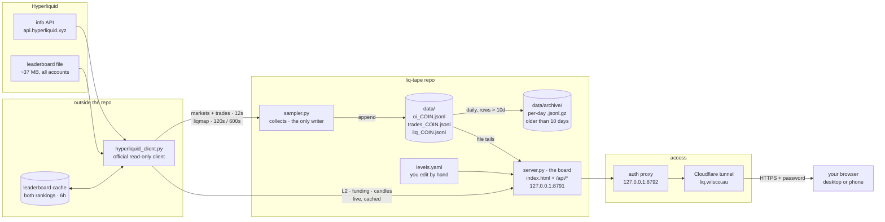
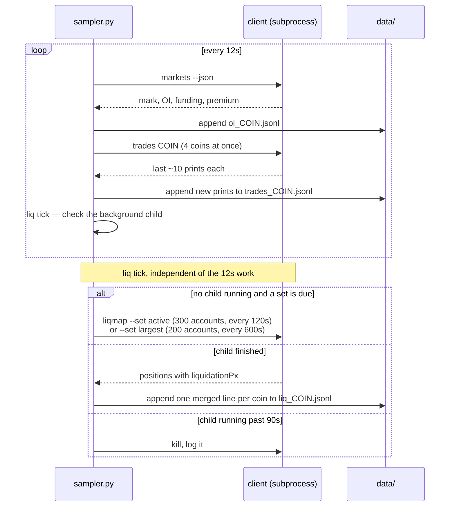

# Architecture

Two processes, one data folder, one page. The **sampler** collects and is the
only thing that writes; the **board** reads and serves. Everything reaches
Hyperliquid through the official read-only client, which lives outside this
repo.

## How the pieces fit



Arrows show which way data flows, left to right: Hyperliquid → client →
sampler → `data/` → board → proxy → tunnel → you. The page in your browser
polls the board's `/api/*` every few seconds (table below). Nothing flows
back to Hyperliquid: no path places an order, holds a key, or writes there.

## Who writes what

| File | Written by | Read by | Cadence |
| --- | --- | --- | --- |
| `data/oi_<COIN>.jsonl` | sampler | board (`/api/oi`, `/api/marks`, liq mark) | every 12s |
| `data/trades_<COIN>.jsonl` | sampler | board (`/api/prints`, `/api/cvd`) | every 12s, new prints only |
| `data/liq_<COIN>.jsonl` | sampler | board (`/api/liq`) | when a liqmap poll finishes |
| `levels.yaml` | you, by hand | board (`/api/levels`, prints tagging) | whenever you save |
| leaderboard cache | client | client | refreshed after 6h |
| `data/archive/<day>/*.jsonl.gz` | sampler (daily retention) | you, for history | rows older than 10 days, daily 00:05 UTC |
| `data/*.log`, `*.pid` | the run scripts (logs capped by the sampler) | you | — |

The server never opens a file for writing; CI greps for it.

## The sampler's clock

One loop, 12s per tick. The liq map runs as a background child process, so a
slow or hung poll never delays the OI write.



At most one liqmap child runs at a time, so the two account sets never burst
the shared rate limit together.

Every OI sample's mark is also handed to the liq poller. When a set's next
snapshot lands, rows from its previous snapshot whose liq price that mark
path crossed are recorded as **swept** and carried on each line for 30
minutes.

Once a day (00:05 UTC, and two minutes after start) a retention thread
moves rows older than 10 days into `data/archive/`. Appends and the pass
share per-file locks, so the tick keeps writing while it runs.

## What the page asks for

The page is static; every number comes from polling the board.

| Endpoint | Source | Page polls | Drives |
| --- | --- | --- | --- |
| `/api/oi/<COIN>` | oi file | 5s | OI × price matrix, price badge |
| `/api/marks/<COIN>` | oi file | 5s | ⑧ mark path |
| `/api/l2/<COIN>` | client, 2s cache | 2s | ④ L2 ladder, walls on ⑧ |
| `/api/prints/<COIN>` | trades file + levels | 12s | prints list, ticks on ⑦ |
| `/api/cvd/<COIN>` | trades file | 5s | CVD spark |
| `/api/liq/<COIN>` | liq file + latest mark | 30s | liq map card, liq lines and swept ghosts on ⑧ |
| `/api/funding/<COIN>` | client, 30s cache | 60s | ⑤ funding |
| `/api/profile/<COIN>` | client candles, 60s cache | 60s | ⑦ volume profile, histogram on ⑧ |
| `/api/levels` | levels.yaml | on load and coin change | ⑥ levels, lines on ⑧ |

## Rate budget

Hyperliquid allows 1200 request-weight per minute per IP. `clearinghouseState`
and `l2Book` cost 2; most other info requests cost 20 or more.

| Consumer | Approx weight / min |
| --- | --- |
| sampler: markets + trades | ~520 |
| board, while a page is open | ~100 |
| liq map: 300 active @ 120s + 200 largest @ 600s | ~340 |
| **total** | **~960** |

Other tools on the same IP are not counted here.

## The page layout

```
┌──────────────────────────────────────────────────────────────────────────┐
│ liq-tape   BTC ETH HYPE SOL                          price · age badge   │
│ layers · lookback · theme chips                          method line     │
├──────────────────────────────────────────────┬───────────────────────────┤
│ ⑧ time × mark                                │ OI × price matrix         │
│   mark path, walls, levels, liq lines,       │   + readout               │
│   vol | liq strip on the right edge          │                           │
│                                              ├───────────────────────────┤
├──────────────────────┬───────────────────────┤ liq map card              │
│ ④ L2 depth           │ prints ≥ $25k · 1h    │   ≤2% · ≤5% · largest     │
│   bids | asks        │   + CVD spark         │   nearest six clusters    │
└──────────────────────┴───────────────────────┴───────────────────────────┘
                              ── first screen ends ──
┌────────────────┬─────────────────────────────┬───────────────────────────┐
│ ⑤ funding 24h  │ ⑥ structure levels          │ ⑦ volume profile          │
└────────────────┴─────────────────────────────┴───────────────────────────┘
```

Under 960px everything stacks in one column.

## The doctrine as architecture

Read-only is the shape of the system, not a policy line. There is no code
path that places an order, holds a credential, or binds a non-loopback
socket. The CI workflow (`.github/workflows/verify.yml`) greps for all of it
on every PR, so a violation cannot merge. The tunnel only reaches the auth
proxy; the board itself still listens on loopback.

## Honest coverage

The panels show what actually happened instead of a prettier picture:

- **Capped / truncated flags** when a file or poll only partly covers what
  was asked (e.g. a liq set that fetched 287 of 300 accounts).
- **Veils** on first paint and on empty data, instead of blank space or
  invented values.
- **Age everywhere**: the price badge, ⑧, and each liq set carry their own
  age and turn amber when stale.
- **Coverage words**: the liq map says which accounts it covers and that it
  is Hyperliquid only, never "the market".

## Ports

| Port | What |
| --- | --- |
| 8791 | board (`server.py`), loopback only |
| 8792 | auth proxy in front of the board (`~/Dev/scripts/watchtower-auth-proxy.py`) |
| 8765 | a different dashboard on this machine (watchtower) |

The tunnel hostname lives in `~/.cloudflared/config.yml`, not in this repo.
